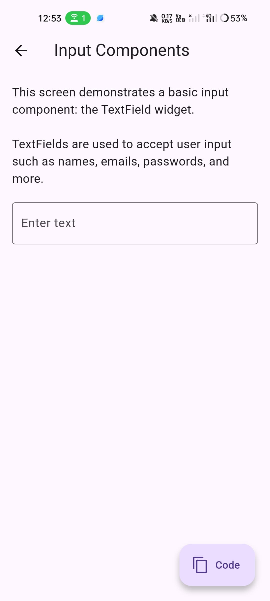
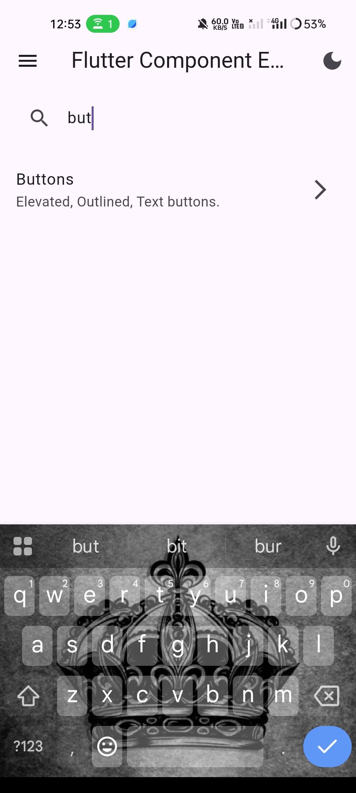
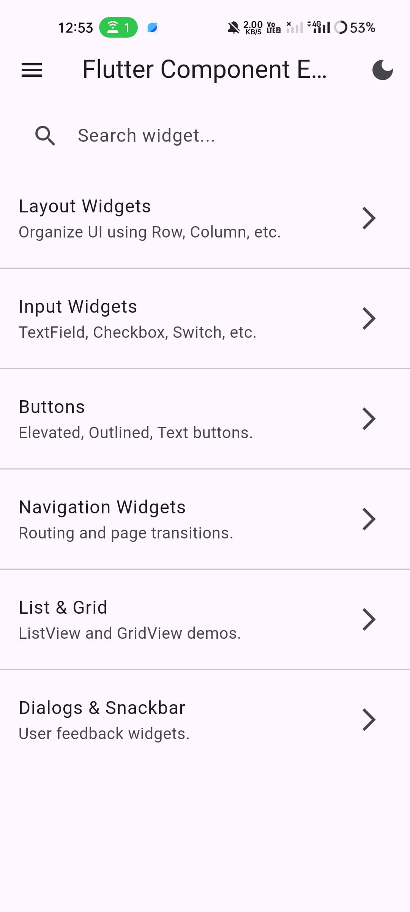
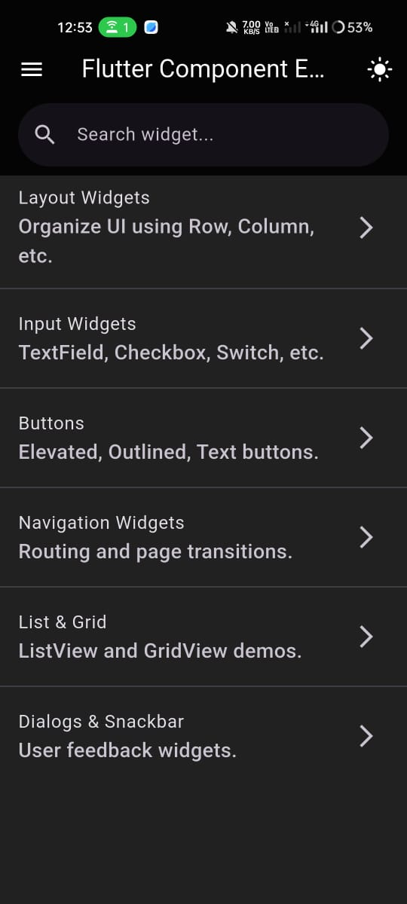

# 🚀 Flutter Component Explorer App

Welcome to the **Flutter Component Explorer**, a Flutter learning app designed for beginners to explore and understand Flutter widgets through beautiful UI examples and real-time previews.

---

## 📱 App Overview

This app serves as a mini Flutter playground that introduces various Flutter components with working demos and source code.

---

## ✨ Features

- 🌗 Light/Dark Theme Switch
- 🧩 Organized by Widget Categories
- 🔍 Instant Widget Search
- 💡 Beginner-Friendly UI
- 💻 View Source Code with Copy Feature
- 🎨 Syntax Highlighting for Code

---
## ✨ Project Structure 

```
repo-mini-project/
├── android/                # Android native files
├── ios/                    # iOS native files
├── lib/                    # Main Flutter code
│   ├── src/                # Source files
│   │   ├── models/         # Data models
│   │   ├── views/          # Screens / UI pages
│   │   ├── widgets/        # Reusable widgets
│   │   ├── controllers/    # Logic and state management (use with Provider, Riverpod, etc.)
│   │   ├── services/       # API services, database services
│   │   ├── utils/          # Helper functions, constants
│   │   ├── routes/         # App navigation and route management
│   │   └── theme/          # App themes, colors, text styles
│   └── main.dart           # Entry point
│
├── assets/                 # Images, fonts, icons
│   ├── images/
│   └── fonts/
│
├── pubspec.yaml            # Flutter dependencies and assets
├── README.md               # Project overview and setup
├── .gitignore              # Ignore build files, IDE files
└── analysis_options.yaml   # Lint rules (optional, for clean code)
```

---

## 🖼️ Screenshots

> 📁 Image Path: `assets/images/`

<table>
  <tr>
    <td align="center"><br/>Home Screen</td>
    <td align="center"><br/>Search & Categories</td>
  </tr>
  <tr>
    <td align="center"><br/>Widget Demo</td>
    <td align="center"><br/>Code Viewer</td>
  </tr>
</table>

---

## 🚀 Getting Started

Clone the repository and run:

```bash
git clone https://github.com/your-username/flutter-component-explorer.git
cd flutter-component-explorer
flutter pub get
flutter run
